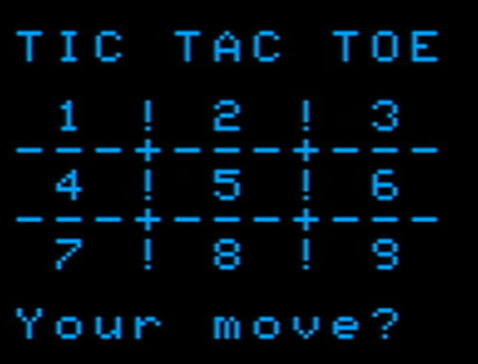

TICTAC: BASIC TIc Tac Toe game for Tandy Color Computer 3
==========

I wrote this Tic Tac Toe game in BASIC for a Tandy Color Computer 3.

The tictactoe strategy the program uses is:

- Take a winning move if there is one
- Block the player from winning if needed
- Take the center square if it's available

If none of those situations is present, it does a Hail Mary pass: it chooses any available square at random.

What it really should do instead is:

- Take a corner square if available
- Take a side square

But I believe this would make the game unbeatable, and the player would force a tie game at best.  So I'm leaving the
program a little stupid to give the poor human a fighting chance.

The program is written to use my BASIC preprocessor so the code can be all pretty, and the preprocessor converts it to
sensible, legal BASIC for the Coco3.  See my [preprocessor](https://github.com/yggdrasilradio/preprocessor) repository for that.

Look in the [redistribute](https://github.com/yggdrasilradio/tictac/tree/master/redistribute) folder for the program in normal DECB ASCII format.

